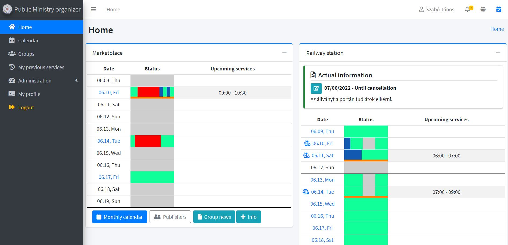
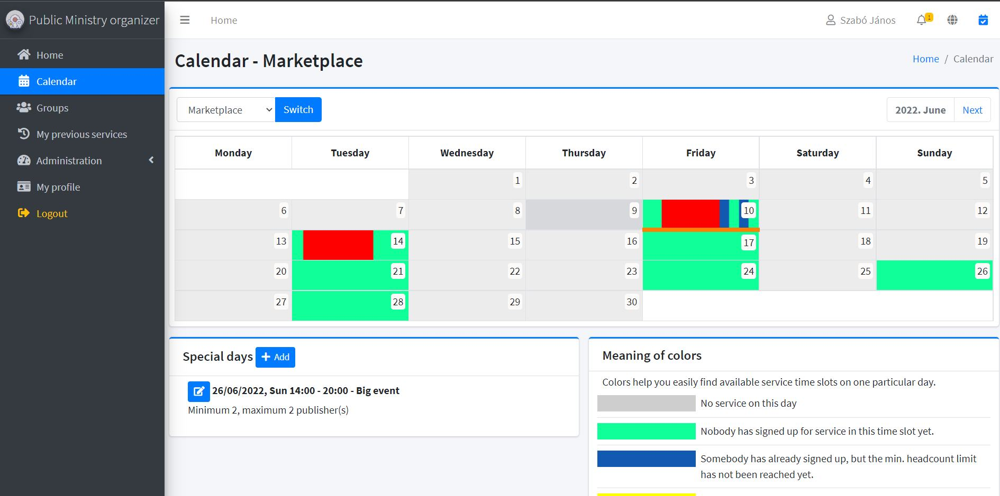

# JW Public Ministry Organizer App

This is a great tool to organize your congregation public ministry service.
You can install it almost any webserver. (See requirements)

## Demo

Please see my videos [here](https://www.youtube.com/channel/UC98z7F9PB8AF-ZPcgIz4FNw/videos).

## Screenshots

Home screen

Day events screen

Monthly calendar

## Basic features

- You can create multiple groups / places where your congregation will make public ministry
- Multiple congregation can use it (they can create separate groups [See](screenshots/groups_diagram.jpg) )

- Easy to use for publishers
- Custom service day and time for each groups
- You can create custom special days (or disable a day)
- Group owners can approve/decline publisher's services (bulk approval or only one service)
- Four privilege levels in each group
- Mobile friendly
- Multi language support (online transation page)
- GDPR ready
- Built in update system
- Lot of email notification (eg. the service approved/declined/deleted,changed)
- Message Board function
- Four privilege level (Group overseer, Group servant, Group helper, Group member)
- Group overseer/servant can set special date if there are different service (or can disable special days)
- Easy customization (Can set by Group overseers and servants)
- Easy to invite new publishers (only email address needed)

Based on [Laravel 8](https://laravel.com/)

## Supported languages

- Hungarian
- English

Any help are welcomed! :)
## Requirements

- A webserver, running PHP 8.0.7 or later
- An existing email address, for email notifications. (You can use smtp, php mail or sendmail)
- You need to run cron for scheduled jobs. [Check documentation](https://laravel.com/docs/8.x/scheduling#running-the-scheduler)
- Mysql / MariaDB database
- You must set your domain's root path to "/public" folder.
- Public domain name

## PHP REQUIREMENTS
- Minimum PHP 8.0.7 
- Allow URL fopen
- INTL PHP extension
- BCMath PHP Extension
- Ctype PHP Extension
- Fileinfo PHP Extension
- JSON PHP Extension
- Mbstring PHP Extension
- OpenSSL PHP Extension
- PDO PHP Extension
- Tokenizer PHP Extension
- XML PHP Extension
## Security & protection

There are some basic protection in login and registration system.
1. Basic rate limit
2. Basic spam protection that try to catch robots
3. You can enable google recaptcha (not neccessary if you not want to)

- User's name and phone number stored in encrypted format in database.
- User's can use 2FA login (you can set this in the "Profile" menu.)

We recommend to use https connection. You can enable it into "Administration/Settings" menu.
## Installation

There are a Step-By-Step install page.

1. Upload all files to your webserver.
2. Set your document root path to "/public" directory. (This is important!)
3. Open your site url, and make the step-by-step setup to install.

If you have any error under installation, just delete .env file and open your site again.

### Important!
Do NOT delete .env file after you create any sensitive data in your site.
Most of the personal data are encrypted, based on "APP_KEY" variable in .env file, so if you modify this, you lose your old encrypted data!

    
## FAQ

#### Can I use this software on shared hosting system?

Yes, just see requirements.

#### Can I translate this software into other languages?

YES! There are a built translation page. You can translate from English or Hungarian.
If you like to share your translation, please contact us, or fork this repo and send your translation.
Any help are welcomed. :)

#### I have an error, what can I do?

Please send us your laravel.log file from "/storage/logs" folder, to analyze your problem.

## About me

I'm a pioneer and love public ministry service! I'm living in Hungary.

## License

[MIT Lincense](https://choosealicense.com/licenses/mit/)

